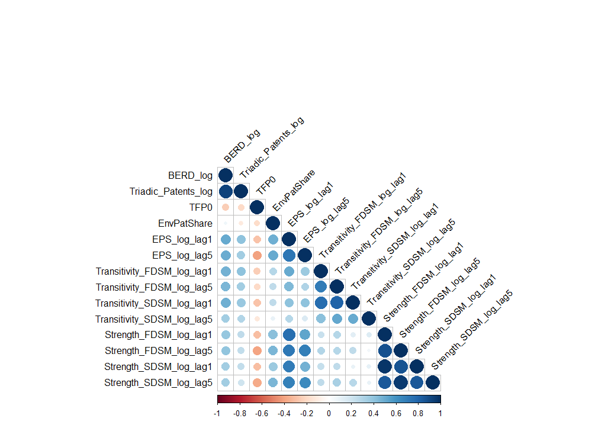

```{r intialize, echo=FALSE}
# Setting chunk opts

# Libraries
library(skimr)
library(tidyverse)
library(gridExtra)
library(kableExtra)
library(tidygraph)
library(ggraph)

# Set paths
project_path <- substr(getwd(), 1, 56)
graph_path <- paste0(project_path, "/graphs/")
ecolex_path <- paste0(project_path, "/data/ECOLEX/Membership/ECOLEX_Membership.rds")
onemodenetpath <- paste0(project_path, "/data/CleanData/OnemodeNetworks/")
clean_data_path <- paste0(project_path, "/data/CleanData/")
```

\setcounter{chapter}{2}
# Methodology and Data {#methodsdata}

This section will outline the computation of a novel set of centrality measures
which will be used in the subsequent analysis to proxy the relative centrality
of countries within the international environmental governance complex and
account for the increasing importance of international policy in tackling
environmental challenges. In what follows, we will describe the construction
of the bipartite membership network of international agreements^[Note that we
interchangeably use bimodal and bipartite as adjectives to qualify the nature
of the original membership network. The original network is both bimodal
since it has two different types of nodes and bipartite since it does
not have links between two nodes of the same type
[@borgatti20092].] and the
extraction of a monopartite cooperation network which defines links between countries
as the number of agreements that have been signed in common. We then
statistically validate this projection by comparing the resulting observed
cooperation network with a null model. This process is also commonly
known as *backbone extraction*. Finally, we describe the computation of
two centrality indices that will proxy the intensity and the certainty of
international policy as well as all other variables of interest.
Let us, however, start by defining the empirical panel model
we will estimate in the next section before detailing the construction of
its various coefficients.

## The Empirical Models

To analyze our unbalanced panel of OECD countries over the period of 1990 to
2015, we define the following regressions to investigate the
*Weak Porter Hypothesis* (WPH).


\begin{multline}
ln(BERD_{it}) = \beta_1 ln(\text{EPS}_{i,\ t-k}) + \\ 
    \beta_2 ln(\text{Strength}_{i,\ t-k}^{M}) + \beta_3 ln(\text{Transitivity}_{i,\ t-k}^{M}) + \\ 
    \beta_4 ln(X_{it}) + \alpha_i + \delta_t + u_{it}
\end{multline}
\begin{multline}
ln(TPF_{it}) = \beta_1 ln(\text{EPS}_{i,\ t-k}) + \\
                \beta_2 ln(\text{Strength}_{i,\ t-k}^{M}) + \beta_3 ln(\text{Transitivity}_{i,\ t-k}^{M}) +
                \\ \beta_4 ln(X_{it}) + \alpha_i + \delta_t + u_{it}
\end{multline}
\begin{multline}
EnvPatShare_{it} = \beta_1 ln(\text{EPS}_{i,\ t-k}) + \\
            \beta_2 ln(\text{Strength}_{i,\ t-k}^{M}) + \beta_3 ln(\text{Transitivity}_{i,\ t-k}^{M}) + \\
            \beta_4 ln(X_{it}) + \alpha_i + \delta_t + u_{it}
\end{multline}


Where the first of our three dependent variables is $BERD_{it}$, the business expenditures
on R&D, which measures the *input* of the R&D process [@oecdMainScienceTechnology2022].
$TPF_{it}$ is the count of triadic family patents i.e. patents that have been granted by the three
largest patent offices worldwide; the European Patent Office (EPO), the Japan
Patent Office (JPO), and the United States Patent and Trademark Office (USPTO)
[@oecdOECDTriadicPatent2022]. This measure proxies the *output* of the innovation
process over both environmental and non-environmental patents.
Finally, we consider $EnvPatShare_{it} \in [0;1]$
which measures the share of environmental patents over total patents by country
[@oecdPatentsEnvironmentTechnologies2022]. This last measure does not test the
*WPH* *per se* but allows us to test whether environmental innovation is
relatively more influenced by changes in domestic environmental
policy stringency or our international policy measures.

On the RHS, $\text{EPS}_{i,\ t-k}$ is a proxy for national environmental policy
stringency over the time period between 1990 and 2015 for OECD countries
[@bottaMeasuringEnvironmentalPolicy2014].
$\text{Strength}_{i,\ t-k}^{M}$ and $\text{Transitivity}_{i,\ t-k}^{M}$ are indices
characterizing the position of a country in the international environmental governance
network. We compute these indices by using
different *backbone extraction* methods $M$ to ensure the robustness of our
results which will be described below. Furthermore, following
@rubashkinaEnvironmentalRegulationCompetitiveness2015
and @martinez-zarzosoDoesEnvironmentalPolicy2019, we make the hypothesis of a
lagged effect of policy signals on innovation and productivity outcomes and
consider a lag structure $k$ of one and five years, respectively.
$X_{it}$ is a vector of control variables including, GDP per capita
as well as import and export intensity measures from the World Bank to account
for the economic integration of a given country in the global trade network
and its relative competitiveness^[Note: All monetary variables have been
standardized to 2015 USD  PPP.] [@worldbankWorldDevelopmentIndicators2022].
Finally, we add both country $\alpha_i$ and time fixed effects $\delta_t$ to
capture the unobserved country and time level heterogeneity in all specifications.

Moving on to the analysis of the *Strong Porter Hypothesis*, we define
a similar panel model where our dependent variable is the growth of
total factor productivity $\Delta TFP_{it}$. This echoes the model run by
@albrizioEnvironmentalPoliciesProductivity2017a who find a positive effect
between the tightening of the EPS of a country and the growth of total factor
productivity^[Unlike @albrizioEnvironmentalPoliciesProductivity2017a,
we consider the level of the EPS index to remain consistent with the
@martinez-zarzosoDoesEnvironmentalPolicy2019 and the other estimations
and not its change.].

$$
\Delta TFP_{it} = \beta_1 ln(\text{EPS}_{i,\ t-k}) + \beta_2 \text{Strength}_{i,\ t-k}^{M} +
\beta_3 \text{Transitivity}_{i,\ t-k}^{M} + \beta_4 X_{it} + \alpha_i + \delta_t + u_{it}
$$

Now that we laid out an overview of the variables that we will consider in our
empirical mode, we continue by defining the construction of the  $\text{Strength}_{it}$ and the
$\text{Transitivity}_{it}$ measures of international governance.
We will subsequently examine the $\text{EPS}_{it}$ indicator as well as the various other dependent
variables of innovation and productivity we succinctly described above.

## Constructing International Environmental Cooperation Centrality Measures

We leverage the ECOLEX dataset to construct country-level measures of
embeddedness in the international environmental cooperation network
[@unepiucnfaoECOLEXGatewayEnvironmental2022]^[To be more specific, we use a
scraped version included in the `{manyenviron}` package
[@hollwayManyenvironEnvironmentalAgreements2021] which was initially used in
@sommerGlobalGovernanceForestry2020]. This dataset lists
environmental agreements between two or more parties and the related
membership actions over the period between 1868 and 2018 and contains over
25000 individual membership actions.^[See Table \@ref(tab:ECOLEX) describing
the structure of the dataset and displaying the first few observations.]
We follow @carattiniWhatDoesNetwork2021
and retain agreements that were signed in the Post-war period starting in
1948. We retain 21270 individual membership actions after filtering out
agreements signed before 1948. After further cleaning the data by excluding
observations on which we do not have identifying information, such as the date of
the ratification of the agreement and the date of entry into force or the
country which is the subject of the membership action, we retain 18878
individual membership actions that describe 521 individual international
environmental agreements.

```{r ECOLEX, echo=FALSE, results='asis', fig.pos = 'htp'}
load(ecolex_path)
# Remove unsigned
ECOLEX_mems <- ECOLEX_mems %>%
  dplyr::filter(!is.na(Force)) %>%
  dplyr::select(ecolexID, treatyID, CountryID, Title, Beg, End,
                SignatureCountry, Rat, Force, DocType, GeogArea, Subject)
# Create table
kableExtra::kbl(head(ECOLEX_mems, 20),
                caption = "ECOLEX Dataset Head",
                booktabs = T) %>%
  kableExtra::kable_styling(latex_options = c("striped", "scale_down")) %>%
  kableExtra::landscape()
```

### From a Bipartite Membership Network

The ECOLEX dataset presented above in \@ref(tab:ECOLEX) can be visualized as
an annual series of undirected, unweighted, bipartite/bimodal networks.
This can be done in the form of a yearly incidence matrix $I_{C \times A}^t$ where each row
corresponds to a country (an agent) and each column to a treaty (an artifact)
[@latapyBasicNotionsAnalysis2008]. The main theoretical difference between the
two sets of nodes is that the former has agency over the links while the latter
does not.^[This distinction will inform the choice of the backbone extraction
algorithm as outlined below.] $i_{ik}^t$ equals $1$
if country $i$ has ratified agreement $k$ which entered into force during or before year
$t$ and $0$ otherwise. A country can only be a member of a treaty once, which implies
that $i_{ik}^t \in \{0,1\}$.

```{=latex}
\begin{equation*}
  \begin{rcases}\displaystyle
    I_{ik}^t = \overbrace{\begin{pmatrix}
    i_{1,1}     & i_{1,2}     & i_{1,3}     & \dots     & i_{1,A}           \\
    i_{2,1}     & i_{2,2}     & i_{2,3}     & \dots     & i_{2,A}           \\
    i_{3,1}     & i_{3,2}     & i_{3,3}     & \dots     & i_{3,A}           \\
    \vdots      & \vdots      & \vdots      & \ddots    & \vdots      \\
    i_{C,1}     & i_{C,2}     & i_{C,3}     & \dots     & i_{C,A}
  \end{pmatrix}}^{\text{Agreements}}
  \end{rcases}
    \text{Countries}
\end{equation*}
```

We can also visualize the bipartite/bimodal membership network directly and
distinguish agreements from countries.
The network depicted in \@ref(fig:ECOLEXbipartitenetwork)
represents the membership network with all agreements that entered into force between
1948 and 1978 and 1948 and 2018, respectively. This illustration shows
that the network grew denser as agreements were signed, ratified, and entered
into force over time. To explore the intertemporal evolution of
the structure of the network, we will divide this network and construct
yearly snapshots of the membership graph whose incidence matrix we define as
$I_{C \times A}^t$, which is the most commonly used method in social network
analysis to account for the intertemporal evolution of a network
[@everettDualprojectionApproachTwomode2013].

```{r ECOLEXbipartitenetwork, echo=FALSE, fig.pos = 'htp', fig.cap = "Bipartite Membership Network Snapshots"}
ECOLEX_mems_net1 <- ECOLEX_mems %>%
  dplyr::mutate(Year = as.numeric(format(ECOLEX_mems$Force, format = "%Y"))) %>%
  dplyr::filter(Year <= 1978) %>%
  dplyr::select(ecolexID, CountryID) %>%
  migraph::as_tidygraph(twomode = T) %>%
  dplyr::mutate(Type = ifelse(type, "Country", "Agreement"))
ECOLEX_mems_net2 <- ECOLEX_mems %>%
  dplyr::mutate(Year = as.numeric(format(ECOLEX_mems$Force, format = "%Y"))) %>%
  dplyr::select(ecolexID, CountryID) %>%
  migraph::as_tidygraph(twomode = T) %>%
  dplyr::mutate(Type = ifelse(type, "Country", "Agreement"))
# Graph things
layout_bi1 <- ggraph::create_layout(ECOLEX_mems_net1, layout = "igraph",
                                algorithm = "bipartite")
layout_bi2 <- ggraph::create_layout(ECOLEX_mems_net2, layout = "igraph",
                                algorithm = "bipartite")
plot1 <- ggraph::ggraph(ECOLEX_mems_net1, layout = layout_bi1) +
  ggraph::geom_edge_link(alpha = 0.01) +
  ggraph::geom_node_point(aes(shape = Type, color = Type)) +
  ggplot2::labs(title = "Membership Network 1948-1978") +
  ggplot2::theme_void() +
  theme(legend.position = 'bottom')
plot2 <- ggraph::ggraph(ECOLEX_mems_net2, layout = layout_bi2) +
  ggraph::geom_edge_link(alpha = 0.01) +
  ggraph::geom_node_point(aes(shape = Type, color = Type)) +
  ggplot2::labs(title = "Membership Network 1948-2018") +
  ggplot2::theme_void() +
  theme(legend.position = 'bottom')
# Combine plots
gridExtra::grid.arrange(plot1, plot2, ncol = 2)
```

### To a Monopartite Cooperation Network

While we could further analyze this bipartite
network directly, we will transform it into a more easily interpretable
one-mode cooperation network. We do so by using a projection and retaining only
statistically significant edges
through a backbone extraction algorithm. We will thus broadly follow
@carattiniWhatDoesNetwork2021 while ensuring that our results are not contingent
on the backbone extraction algorithm since the theoretical underpinnings of
the latter are still somewhat unclear in empirical social network analysis
[@nealComparingAlternativesFixed2021].

We begin by creating a naive projection of the membership network. To perform
this naive projection, we multiply the yearly incidence matrix $I_{c \times a}^t$
defined above by its transposed $I_{A \times C}^t$ as follows:

$$
I_{C \times A}^t I_{A \times C}^t = Adj_{C\times C}^t
$$

Where $Adj_{c\times c}^t$ is the adjacency matrix of the projected cooperation network in
which $p_{ij}^t$ is the number of observed co-signed agreements between two countries
that entered into force in the interval $[1948; t]$. These weights capture
the intensity of the environmental cooperation between two countries, much like
@newmanScientificCollaborationNetworks2001 captured the intensity of
scientific collaboration within a bipartite network of scientists. Concurrently,
it implies that bilateral treaties, ceteris paribus, carry a greater weight
in the cooperation network than multilateral treaties, which is consistent with
the heterogeneous role both play within the environmental governance network.
As highlighted by @hollwayMultilevelEmbeddednessCase2016, bilateral treaties
are akin to contracts between two parties, while multilateral treaties serve as
"normative [...] law-making tools". While both types may act as policy stringency
signals, bilateral treaties carry more weight through their specific contractual nature
hence developing a greater policy stringency signal for firms making them more
relevant in our study.

We cannot, however, directly analyze this cooperation network as the resulting
*naive* monopartite network, depicted in the first panel of
\@ref(fig:ComparingBackbones), still suffers from two issues. First, nodes
with larger degrees in the original bipartite membership network
(e.g. agreements with a larger number of signatories or
countries having signed a larger number of agreements) will intrinsically yield
stronger edges in the projected network. In other words,
if *country A* and *country B* are bound by the same five agreements and have
each signed five agreements in total, they are conceptually "closer" than
*country C* and *country D* who share the membership in ten agreements but
have each signed a total of 50 agreements
[@borgatti2011analyzing; @latapyBasicNotionsAnalysis2008;
@nealBackboneBipartiteProjections2014;
@saraccoInferringMonopartiteProjections2017]. However, in the resulting one-mode
projection, the latter will be weighted more than the former.
The second issue relates to the fact that *naive* projections may lead to the
emergence of spurious cliques in the projection due to a node with a
single connection to the opposite layer in the original bipartite network 
[@saraccoInferringMonopartiteProjections2017]. To solve these two common issues,
we leverage what is known as a backbone extraction algorithm to retain only the
statistically significant edges from the naive projection e.g. the edges
that appear more frequently in the projection than expected by a given null
model.

### Correcting the Monopartite Cooperation Network

We will use the following three distinct backbone extraction methods to ensure
that our results are not the product of the choice of a particular extraction
method alone. This is especially crucial since we do not have a "ground truth"
or a counterfactual monopartite cooperation network to compare the corrected
projection to. We, therefore, depart from @carattiniWhatDoesNetwork2021 who
consider only a single backbone extraction method.
All three considered algorithms follow the same process in that they
impose a constraint $M$ on the original bipartite
network and reshuffle the values of the incidence matrix $I_{C \times A}$.^[We
broadly follow the notation used in @nealComparingAlternativesFixed2021
where each backbone extraction method is described in more detail.
Furthermore, we abstract from superscript $t$ to indicate the network's time period as
we apply the backbone extraction method to each temporal snapshot of the network.]
In other words, we consider the set of all possible permutations of the original
incidence matrix $I_{c \times a}^t$ containing the same countries and treaties
and satisfying the constraint $M$. We call this set $\mathcal{I}^M$
which consists of the individual permutated matrices $I^*$. The algorithm
then constructs the one-mode projection of $I^*$ as follows: $P^* = I^*\times [I^*]^T$.
Recall that when performing the naive projection, we defined $p_{ij}$ as the observed
number of co-signed treaties between country $i$ and country $j$.
To decide whether an edge between $i$ and $j$ should be included in the
backbone of the projected network, the algorithm compares the observed value $p_{ij}^t$
to the simulated one in $P^*$ which we call $p_{ij}^*$. We, therefore, define
the following two-sided hypothesis test to characterize the presence (or absence)
of a tie $p_{i j}^{B}$ in the backbone $P^B$ based on a significance level $\alpha$.

$$
p_{i j}^{B}=
\begin{cases}1 & \text { if } \operatorname{Pr}\left(p_{i j}^{*} \geq p_{i j}\right)<\frac{\alpha}{2} \\
0 & \text { else }\end{cases}
$$

As described in @nealComparingAlternativesFixed2021, we use a two-tailed test
since we would like to filter out both uncommonly small *and* uncommonly large
collaborative ties in the projection. @nealBackbonePackageExtract2022 point
out that since we perform this hypothesis test for every non-null edge, we
will inflate the Type-I error i.e. include too many false positives in our
corrected graph. ^[The significance level $\alpha$ defines the probability
that a given edge is included in the backbone. Since we run this test over
$e$ edges, the probability that we detect at least one such false positive across our
test equals $1-(1-\alpha)^e$ which is strictly increasing in the number of tests
$e$.] Following @nealBackbonePackageExtract2022, we leverage the
False Discovery Rate multiple test correction
method, which sorts the observed p-values in an increasing order before retaining
all edges with a p-value satisfying $\text{P-value}_{d}\leq \frac{d}{m} \alpha$
where $d \in \{1,\dots, e\}$ for all backbone extraction methods
[@benjaminiControllingFalseDiscovery1995].

Finally, this hypothesis test yields a binary correction
matrix which informs us whether to keep a tie in the naive projection or not and
thereby solves both issues of the naive projection described above.
Now that we have a general understanding of the process
of a backbone extraction algorithm, we turn to the following three subsections,
which will focus on the differences between the
backbone algorithms, which lie in the nature of the constraint they
impose on the simulated networks. We will thus consider, in turn, the
Fixed Row Model (FRM), the Fixed Degree Sequence Model (FDSM), and the
Stochastic Degree Sequence Model (SDSM).

#### Fixed Degree Sequence Model

The Fixed Degree Sequence Model (FDSM) is a microcanonical backbone extraction
method in that the constraint that it imposes on the set of possible permutations
$\mathcal{I}^{FDSM}$ is satisfied *exactly*.^[This stands in opposition to
canonical extraction algorithms that impose the constraint only *on average*
over all simulated networks. This is done to speed up computation when dealing
with vast networks.]
More specifically, the FDSM algorithm sets the degrees of each agent and
each artifact to be equal to the degree sequences of the observed network.
In our context, it implies that the row and column sums of the simulated $I_{ik}^*$
are to be equal to those of the observed bipartite network $I_{ik}$ under the
FDSM algorithm.

$$
  I_{ik}^* = 
\begin{blockarray}{cccccc}
\begin{block}{(ccccc)c}
  1 & 1 & 1 & \dots & 1 & \sum_{k = 1}^{A} i_{1k} \\
  0 & 1 & 0 & \dots & 1 & \sum_{k = 1}^{A} i_{2k} \\
  0 & 0 & 1 & \dots & 1 & \sum_{k = 1}^{A} i_{3k} \\
  0 & 1 & 0 & \dots & 1 & \sum_{k = 1}^{A} i_{4k} \\
  \vdots & \vdots & \vdots & \ddots & \vdots & \vdots \\
  0 & 1 & 0 & \dots & 1 & \sum_{k = 1}^{A} i_{Ck} \\
\end{block}
\sum_{i = 1}^{C} i_{i1} & \sum_{i = 1}^{C} i_{i2} & \sum_{i = 1}^{C} i_{i3} & \dots & \sum_{i = 1}^{C} i_{iA} \\
\end{blockarray}
$$

As @nealComparingAlternativesFixed2021 point out, this methods main advantage is
that it can alleviate the two issues plaguing our *naive projection* outlined
above by controlling for the vector of degrees. As
@vasquesfilhoTransitivityDegreeAssortativity2020 point out, degree sequences
of bipartite networks are chiefly responsive for the structure of their
monopartite projections.
The main disadvantage of such an algorithm is that it is ill-suited for large
bipartite networks due to its computational complexity
[@nealComparingAlternativesFixed2021]. A set of alternative models has been developed
to alleviate this computational issue, among which are the Fixed Row Model
and the Stochastic Degree Sequence Model, which we define below^[We were fortunately
still able to estimate the backbone via this method within about a day.].

#### Fixed Row Model

Like the FDSM, the Fixed Row Model (FRM) is also a microcanonical algorithm.
However, the main difference is that it imposes the degree sequence constraint
on the row sums of the incidence matrix only ^[E.g.
$$
\forall_{i \in \{1,...,C\}} \sum_{k = 1}^{A} i_{ik} = \forall_{i \in \{1,...,C\}} \sum_{k = 1}^{A} 
i_{ik}^*
$$
] ^[The FRM model is also sometimes referred to as the hypergeometric
model [@tumminelloStatisticallyValidatedNetworks2011].].
That is, the degree of every agent/country is strictly controlled for. This
implies that a country will be bound by the same number of agreements in all
simulated networks as in the observed network. However, an agreement
is free to have a different number of total signatories. This leads us to the
reason why we are not considering the Fixed Column Model: agency. Recall that
we previously defined two distinct sets of nodes depending on whether or not
the nodes possess agency over the links they would like to create or dissolve.
Since agreements do not have agency and are constructed through the will
of countries, we constrain the latter's degree only.
@carattiniWhatDoesNetwork2021 applied the Bipartite Partial Configuration Model,
which is the canonical version of the FRM algorithm, to their membership network
[@saraccoInferringMonopartiteProjections2017].
This implies that the restriction imposed on the degree sequence of countries
is only satisfied *on average* over all simulations. Since our membership
network is small enough to be corrected by applying the more computationally
intensive FRM algorithm, we follow the latter as it carries more information
about the structure of the original bipartite network than the BiPCM algorithm
[@saraccoInferringMonopartiteProjections2017]. Furthermore, as we see in
\@ref(fig:ComparingBackbones), the FRM is already too weakly constrained and
does not solve the two issues of the naive projection. We, therefore, argue that
the BiPCM algorithm would be ill-suited for our purpose. We now move to Stochastic
Degree Sequence Model, the last backbone extraction algorithm we considered.

#### Stochastic Degree Sequence Model

The Stochastic Degree Sequence Model (SDSM) is a canonical algorithm that
imposes a constraint on both the degree sequence of countries and the
degree sequence of agreements. However,
the set of simulated networks satisfies this constraint only on the *average*
of all simulated networks. This makes it very similar to the FDSM algorithm
while imposing somewhat looser constraints.
In other words, this implies that the average number of member countries
of a given international agreement $k$ in the set of simulated networks is equal
to the number of member countries in the observed membership network. Conversely,
it also implies that the average number of agreements signed by a given country
$i$ in the set of simulated networks is equal to the number of agreements
signed by country $i$ in the observed network. Several methods exist to
simulate networks satisfying this constraint. These are compared in terms of
accuracy and computational speed in @nealComparingAlternativesFixed2021.
The authors show that the Bipartite Configuration Model (BICM) is the
fastest and most accurate method to generate simulated networks satisfying
the average condition specified above [@saraccoInferringMonopartiteProjections2017]. Finally,
given our bipartite network characteristics and the computational
complexity of the FDSM algorithm,
@nealComparingAlternativesFixed2021 and @nealBackbonePackageExtract2022
recommend the use of this algorithm over other solutions. We thus leverage it
as our third and last backbone extraction model.

#### Comparing the Projections

Before moving on to the definition of the various centrality measures we
will use to measure the level of international embeddedness of countries
within the network of international environmental agreements, we will compare
the resulting corrected projections. We namely see that the correction
performed by the FROW backbone extraction process retains about 90 percent of the
edges of the naive projection, which leads to an overly dense network. Therefore, we
will not consider it in the further analysis as it does not solve
the two issues we are trying to correct. This is consistent with Carattini et al.
who mention that their BiPCM-corrected cooperation network's density is so high that
almost every node is connected to each other [@carattiniWhatDoesNetwork2021].
On the other hand, both the
SDSM and the FDSM algorithms retain, on average, about 15 percent of the most significant
edges present in the naive projection. This ensures that we capture the actual
cooperative network and not a statistical artifact caused by the two issues
we are trying to correct for. Furthermore, as we mentioned above,
@nealComparingAlternativesFixed2021 recommend the use of the SDSM extraction
process given the bipartite membership network it was provided.
We will, thus, compute the centrality scores on the basis of the latter two
corrected networks.

```{r ComparingBackbones, fig.cap="Comparing Backbone Extraction Methods", fig.pos="htp"}
# Load different networks 2015
Naive <- tidygraph::as_tbl_graph(readRDS(paste0(onemodenetpath, 
                                                "Onemode_Network_Naive_2010.rds")))
FDSM <- tidygraph::as_tbl_graph(readRDS(paste0(onemodenetpath, 
                                               "Onemode_Network_FDSM_NonFDR_2010.rds")))
FROW <- tidygraph::as_tbl_graph(readRDS(paste0(onemodenetpath, 
                                               "Onemode_Network_FROW_2010.rds")))
SDSM <- tidygraph::as_tbl_graph(readRDS(paste0(onemodenetpath, 
                                               "Onemode_Network_SDSM_2010.rds")))

# Graph things
layout_naive <- ggraph::create_layout(Naive, layout = "igraph",
                                algorithm = "lgl")
layout_FROW <- ggraph::create_layout(FROW, layout = "igraph",
                                algorithm = "lgl")
layout_SDSM <- ggraph::create_layout(SDSM, layout = "igraph",
                                algorithm = "lgl")
layout_FDSM <- ggraph::create_layout(FDSM, layout = "igraph",
                                algorithm = "lgl")
Naive_plot <- ggraph::ggraph(Naive, layout = layout_naive) +
  ggraph::geom_edge_link(alpha = 0.01) +
  # ggraph::geom_node_label(aes(label = name), repel = T) +
  ggplot2::labs(title = "Cooperation Network Naive",
                caption = "ECOLEX, 1948-2010") +
  ggplot2::theme_void()
FROW_plot <- ggraph::ggraph(FROW, layout = layout_FROW) +
  ggraph::geom_edge_link(alpha = 0.01) +
  # ggraph::geom_node_label(aes(label = name), repel = T) +
  ggplot2::labs(title = "Cooperation Network FROW",
                caption = "ECOLEX, 1948-2010") +
  ggplot2::theme_void()
SDSM_plot <- ggraph::ggraph(SDSM, layout = layout_SDSM) +
  ggraph::geom_edge_link(alpha = 0.01) + 
  # ggraph::geom_node_label(aes(label = name), repel = T) +
  ggplot2::labs(title = "Cooperation Network SDSM",
                caption = "ECOLEX, 1948-2010") +
  ggplot2::theme_void()
FDSM_plot <- ggraph::ggraph(FDSM, layout = layout_FDSM) +
  ggraph::geom_edge_link(alpha = 0.01) +
  ggplot2::labs(title = "Cooperation Network FDSM",
                caption = "ECOLEX, 1948-2010") +
  ggplot2::theme_void() +
  theme(legend.position = 'bottom')
# Combine plots
gridExtra::grid.arrange(Naive_plot, FROW_plot,
                        SDSM_plot, FDSM_plot,
                        ncol = 2)
```

### Selecting and Computing Network Centrality Measures

Now that we constructed and corrected the monopartite cooperation networks,
we can characterize the topological position of a given country within the
network. Thus, we construct proxies for the *embeddedness* of a country in the
international environmental governance complex, which we hypothesize affect
the rates of innovation and/or its competitiveness in direct and indirect ways.
While there exists a multitude of centrality indices to characterize the
position of a country and no unifying theoretical framework for defining it, we will
consider the commonly used strength centrality measure and the
transitivity or triadic closure measure, which we will describe in turn.

#### Strength Centrality

The strength of a node in an undirected and unweighted network measures the
number of ties emanating from a node and weights them by their respective
weights as follows:

$$
s_{i}=\sum_{j=1}^{N} a_{i j} w_{i j}
$$

Strength centrality echoes the proxy @jahnPoliticsEnvironmentalPerformance2016
used to measure embeddedness in the
international governance complex in that it captures the sum of
cooperative ties of a given country within the weighted network of ties. Hence
we expect that a country with a higher level of strength, ceteris paribus,
will be more embedded in the international environmental agreement network.
As stated in the previous chapter, we expect that this increased embeddedness
leads to an increase in environmental innovation through both direct effects
of the international policy framework and the indirect effects of greater
policy certainty. While we cannot formally distinguish both channels,
it is reasonable to expect that the strength of a node captures a relatively greater share of
the direct effects of the increased embeddedness on innovation as
it measures the number of agreements a country is bound by. This measure can thus
be interpreted as a measure for *international environmental stringency* and
interpreted as a proxy for the *direct effects* of environmental governance on
innovation and competitiveness.
We will now extend our analysis by defining a proxy capturing the indirect effects
of embeddedness within an international environmental collaboration network.

```{r strengthmetric, echo=FALSE, fig.cap="Strength 1990-2015", warning=FALSE, message=FALSE, fig.pos="htp"}
readRDS(paste0(clean_data_path, "Panel.rds")) %>%
  ggplot2::ggplot(aes(x = Year, y = Strength_SDSM)) +
  ggplot2::geom_line(aes(color = Country), size = 0.6) +
  ggplot2::guides(color = guide_legend(title = "Country")) +
  ggplot2::labs(y = "Node Strength (SDSM)",
                caption = "ECOLEX and own calculations. SDSM backbone correction.") +
  iheiddown::theme_iheid()
```

#### Transitivity

The weighted clustering coefficient extends the notion of embeddedness by
computing the weighted proportion of triangles over connected triples
that are centered on a given node [@barratArchitectureComplexWeighted2004].
In the illustration below \@ref(fig:transitivitygraph), we see that
the figure on the right is an open triple from the point of view of the orange
node but not a triangle as opposed to the figure on the left. If we abstract
from the weights, it is easy to see that the local transitivity coefficient,
also known as triadic closure, of the orange node on the left figure is
equal to 1, while the local transitivity of the orange node on the right-hand
side figure is 0.

```{r transitivitygraph, echo=FALSE, fig.cap = "Transitivity", fig.pos="htp"}

```

Mathematically, @barratArchitectureComplexWeighted2004 define the weighted index as follows,
where $w_{i j}$ is the weight of the link between node $i$ and node $j$,
$a_{ij}$ is a binary variable indicating the presence of an edge between $i$ and $j$,
$s_i$ is the strength of node $i$, and $k_i$ is the node's degree.

$$
c_{i}^{w}=\frac{1}{s_{i}\left(k_{i}-1\right)} \sum_{j, h} \frac{\left(w_{i j}+w_{i h}\right)}{2} a_{i j} a_{i h} a_{j h} \in [0;1]
$$

In our international cooperation network, we can interpret this coefficient
as the local empirical reflection of closure which is a characteristic of
a network where agents have a low level of information asymmetry about
the actions undertaken by each other node over time [@colemanSocialCapitalCreation1988].
This facilitated monitoring favors the application of sanctions if an agent defects,
as well as the emergence of a virtuous cycle of trust and further cooperation
[@burtNetworkStructureSocial2000].
This virtuous cycle echoes the sociological argument by
@granovetterEconomicActionSocial1985 who posits that the cost of breaking a
friend's trust and, therefore the friendship is greater when both agents have a
friend in common since the betrayal may also affect one's relationship with the
latter. This argument has been made concurrently in economics and
especially within the game-theoretical analysis of repeated games
[@tullockAdamSmithPrisoners1985] and within the empirical analysis of
reputation in medieval trading [@greifReputationCoalitionsMedieval1989].
Thus, the central insight in our case of international cooperation is
that countries with a higher transitivity index will have a higher cost of
defecting. This, in turn, leads to a higher level of trust within the network
and, crucially in our case, a higher level of economic policy certainty which
we hypothesize is favorable to the process of innovation and competitiveness.
Hence, this measure proxies the *indirect effects* that international embeddedness
has on our dependent innovation and competitiveness variables.

```{r transmetric, echo=FALSE, fig.cap="Transitivity 1995-2015", warning=FALSE, message=FALSE, fig.pos="htp"}
readRDS(paste0(clean_data_path, "Panel.rds")) %>%
  ggplot2::ggplot(aes(x = Year, y = Transitivity_SDSM)) +
  ggplot2::geom_line(aes(color = Country), size = 0.6) +
  ggplot2::guides(color = guide_legend(title = "Country")) +
  ggplot2::labs(y = "Node Transitivity (SDSM)",
                caption = "ECOLEX and own calculations. SDSM backbone correction.") +
  ggplot2::xlim(1995, 2015) +
  iheiddown::theme_iheid()
```

Now that we have defined the computation of a novel set of measures characterizing
international cooperation let us turn our attention to other, more standard
variables that we include in our empirical analysis.

## Other variables

### Environmental Policy Stringency Index

The Environmental Policy Stringency Index (EPS) is an index created by the OECD
which measures the stringency of environmental policy at the country level
from 1990 to 2015 [@bottaMeasuringEnvironmentalPolicy2014].
As pointed out by @poppEnvironmentalPolicyInnovation2019, the
index is often used as an empirical proxy to measure environmental policy in
the literature, including in studies examining Porter's Hypothesis
[@galeottiMeasuringEnvironmentalPolicy2020;
@martinez-zarzosoDoesEnvironmentalPolicy2019]. While we refer the reader
to the original paper by @bottaMeasuringEnvironmentalPolicy2014 for a detailed
description of the construction of the index, we can summarize it as follows.
The basis of the EPS index is constituted of individual indices of policy stringency such
as emission taxes, trading schemes, environmental standards, and governmental
R&D subsidies. These individual policy categories are then ranked
on a Lickert scale between 0 and 6 before being aggregated into market and
non-market-based policies. These two subsets are then once again
aggregated into the composite EPS index with equal weights, which provides us
with a reliable country-level measure of aggregate domestic environmental policy.
Overall, one can discern a positive trend in the stringency level over the
considered period for every country, indicating the implementation of more
stringent domestic environmental policies.

```{r EPSdesc, echo=FALSE, fig.cap="Environmental Policy Stringency 1990-2015", fig.pos="htp", warning=FALSE, message=FALSE}
readRDS(paste0(clean_data_path, "Panel.rds")) %>%
  ggplot2::ggplot(aes(x = Year, y = EPS)) +
  ggplot2::geom_line(aes(color = Country), size = 0.6) +
  ggplot2::guides(color = guide_legend(title = "Country")) +
  ggplot2::labs(caption = "OECD, 2015") +
  iheiddown::theme_iheid()
```

### Innovation and Productivity Measures

We measure innovation, the first of our dependent variables, in two main ways.
First, we consider the Business Expenditures on R&D (BERD) to capture the *input* 
side of the innovation process by using data from the OECD 
[@oecdMainScienceTechnology2022]. We complement the insight from this analysis
by using Triadic Patent Family (TFP) counts, and Environmental Patent (EnvPat) 
counts to proxy the *outcome* of the research process
[@oecdOECDTriadicPatent2022; @oecdPatentsEnvironmentTechnologies2022].
Both insights are complementary as Business Expenditures on R&D 
give a good approximation of the importance placed on the R&D process by firms.
At the same time, Triadic Family Patent counts and the country-level share of environmental
patents allow us to examine the effect of environmental policy on the *outcomes*
of inventive activity [@poppEnvironmentalPolicyInnovation2019]. However, a few caveats must be
borne in mind when using patent counts as a proxy for innovative activity.
First, as @martinez-zarzosoDoesEnvironmentalPolicy2019 point out, using single
country patent counts may lead to issues such as the double counting of patents
registered in multiple patent offices. A related
issue is that one might capture too many low-value innovations when using single
patent office patent counts. In other words, if firms seek protection from multiple
patent offices, it is likely to be for a valuable innovation due to the associated
patenting costs.
We remedy both issues by considering the count of
*patent families* as described by @martinezInsightDifferentTypes2010 rather than
individual patent office patent counts^[Triadic patent families are groups of
similar patents that have been registered with the three main patent offices in
the world: the USPTO, the Japanese Patent Office, and the European Patent Office].
Finally, as pointed out by @poppEnvironmentalPolicyInnovation2019 and
@martinez-zarzosoDoesEnvironmentalPolicy2019 national legislation and accountancy
criteria of patents can bias the results. We will account for this heterogeneity
by including country fixed effects in all our estimations.
Overall, the combination of these innovation proxies will allow us to assess
the *Weak Porter Hypothesis*. Let us now visualize the intertemporal evolution of all
three innovation proxies.

Beginning with our business expenditure on R&D data (BERD), we identify a clear
upward trend in the logged BERD, indicating an increase
in the level of expenditures on R&D across all countries. In addition,
we note a considerable country-level heterogeneity, with the top 3 countries
being the United States, Japan, and Germany.

```{r BERDdesc, echo=FALSE, fig.cap="Business Expenditures in R\\&D 1990-2015", fig.pos="htp", warning=FALSE, message=FALSE}
readRDS(paste0(clean_data_path, "Panel.rds")) %>%
  ggplot2::ggplot(aes(x = Year, y = log(berd))) +
  ggplot2::geom_line(aes(color = Country), size = 0.6) +
  ggplot2::guides(color = guide_legend(title = "Country")) +
  ggplot2::labs(caption = "OECD, 2022",
                y = "log(BERD)") +
  iheiddown::theme_iheid()
```

Triadic family patent counts show a similar pattern with respect to country-level
heterogeneity. The top three countries are, once again, Japan, the United
States, and Germany. While some countries, such as Japan and the US,
saw a marked increase in the yearly patent counts, most countries' counts
remained relatively constant over time.

```{r TPFdesc, echo=FALSE, fig.cap="Triadic Patent Counts 1990-2015", fig.pos="htp", warning=FALSE, message=FALSE}
readRDS(paste0(clean_data_path, "Panel.rds")) %>%
                     ggplot2::ggplot(aes(x = Year, y = triadic_patent)) +
                     ggplot2::geom_line(aes(color = Country), size = 0.6) +
                     ggplot2::guides(color = guide_legend(title = "Country")) +
                     ggplot2::labs(caption = "OECD, 2022",
                                   y = "Triadic Patent Count") +
                     iheiddown::theme_iheid()
```

Considering the share of *environmental* patents with respect to
total patents allows us to refine our analysis by matching environmental
policy to environmental patents. This link is key since environmental innovative
activity should intuitively be more strongly affected by environmental policy
than other technologies.

```{r EnvPatdesc, echo=FALSE, fig.cap="Environmental Patent Share 1990-2015", fig.pos="htp", warning=FALSE, message=FALSE}
readRDS(paste0(clean_data_path, "Panel.rds")) %>%
  ggplot2::ggplot(aes(x = Year, y = EnvPatShare)) +
  ggplot2::geom_line(aes(color = Country)) +
  ggplot2::guides(color = guide_legend(title = "Country")) +
  ggplot2::labs(caption = "OECD, 2022",
                y = "Environmental Patent Share %") +
  iheiddown::theme_iheid()
```

The *Strong Porter Hypothesis* we laid out in the previous chapter links
environmental policy stringency and productivity or profits. We test this
hypothesis by regressing total factor productivity growth on the independent domestic
and international policy variables. To that effect, we will use the
Total Factor Productivity growth developed by the Vienna Institute
for International Economic Studies [@stehrerWiiwGrowthProductivity2022].
We will follow @martinez-zarzosoDoesEnvironmentalPolicy2019 and use the
"TFP0" decomposition of GDP based on capital stocks and hours worked only
as defined below.

$$
\Delta \ln Y=\Delta \ln T F P 0+\bar{s}_{C} \Delta \ln K+\bar{s}_{L} \Delta \ln H
$$

Two features are salient from the graph below. First and foremost, we observe
a form of growth rate convergence among OECD countries over the considered time
period at around $0\%$ to $2.5\%$ where high-income countries tend to have a
lower TFP growth rate than middle-income countries^[Relative to OECD countries.].
A second prominent feature is the impact of the 2008 financial crisis, which hit
all countries' TFP growth hard. Although still more measured in the following
years, the TFP growth rate recovered rapidly. Finally, note that
we estimate this model from 1996 onward only due to data availability.

```{r TFP0desc, echo=FALSE, fig.cap="Total Factor Productivity 1996-2015", fig.pos="htp", warning=FALSE, message=FALSE}
readRDS(paste0(clean_data_path, "Panel.rds")) %>%
  ggplot2::ggplot(aes(x = Year, y = TFP0)) +
  ggplot2::geom_line(aes(color = Country), size = 0.6) +
  ggplot2::guides(color = guide_legend(title = "Country")) +
  ggplot2::labs(caption = "EU KLEMS, 2022",
                y = "Total Factor Productivity\n(growth rate %)") +
  ggplot2::xlim(1995, 2015) +
  iheiddown::theme_iheid()
```

## Correlations

Before moving on to the results, let us consider the correlations between
our variables of interest. The first four columns in the correlogram
\@ref(fig:correlations) correspond to the correlations between the four
dependent variables and the domestic and international policy variables.
We examine the correlations of different lags and different specifications
of the independent policy variables to ensure that our results are consistent
across all specifications. We namely see that the business expenditure variable
on R&D is positively correlated with all policy variables, both domestic and
international, as well as across lags and FDSM/SDSM specifications. Concurringly,
the other innovation outcome proxies, Triadic Family Patent counts and the share
of environmental patents, are also positively correlated with all policy measures,
although less strongly.
This evidence, therefore, yields the first hint for the confirmation of the
*Weak Porter Hypothesis*. On the other hand, we see that the growth rate of total factor
productivity (*TFP0*) seems to be
weakly negatively correlated to our policy measures which seemingly suggesting that
the *Strong Porter Hypothesis* may not be verified in our case. Let us now
move on to the estimation of the empirical model defined in the beginning of this
section at the next chapter to investigate these simple correlations further.

```{r correlations, echo=FALSE, fig.cap="Correlations"}

```
